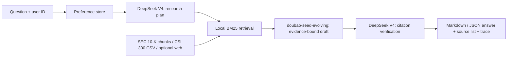

# System Design

## Goal and boundary

The system is a personal financial research agent, not an autonomous trading or recommendation system. Its core promise is narrower: for a question about a supported filing or market dataset, it returns evidence that a reviewer can navigate back to. This prioritizes traceability over a broad but unverifiable tool catalogue.

The supported corpus is ten named public companies' SEC 10-Ks plus CSI 300 daily close and volume from 2005 onward. An opt-in web-search tool gives the agent a way to discover public information, but its result snippet is never silently mixed with primary filings. Every source says whether it is `sec_10k`, `market_data`, or `web_search`.

## Data ingestion and provenance

The SEC downloader first queries each company's `data.sec.gov/submissions` feed, selects `10-K` rows, then downloads the primary document from SEC Archives. It enforces a SEC-style User-Agent containing a contact email. The append-only `manifest.jsonl` records CIK, ticker, form, filing/report dates, accession number, archive URL, local path, and fetch time. The corresponding raw HTML is retained locally. If a company fails, `download_report.json` exposes it instead of presenting an incomplete corpus as complete.

CSI 300 data comes from Tencent Finance's public K-line endpoint. The endpoint caps a response, so the loader requests one calendar year at a time. It writes normalized `date,close,volume` CSV plus a metadata sidecar with source endpoint, all request URLs, download time, row count, and coverage. Calculated period changes always cite that data file and source endpoint, rather than relying on a model calculation.

The indexer strips script/style content, normalizes text, and splits it into overlapping chunks. Each chunk carries document and chunk IDs, title, source URL, filing date, source type, and accession locator. Those fields survive retrieval; the final source list renders both accession and chunk ID. This supports three debugging questions: “which document?”, “where on the public site?”, and “which exact retrieval fragment?”

## Retrieval, reasoning, and memory

Retrieval is deterministic BM25-style lexical scoring. It is deliberately simpler than a vector database: the corpus is small, score inputs are inspectable, it runs with no hosted dependency, and it gives an offline demo path. A user can scope the corpus before retrieval with `--company`. User preferences are a separate JSON document keyed by user ID. The memory only writes when language explicitly signals a preference (for example, “I care”, “focus”, or “关注”), avoiding the common failure where every question becomes permanent memory. It recognizes a small auditable preference vocabulary: liquidity risk, debt maturity, cash flow, profitability, competition, and valuation.

The required two-model collaboration has distinct jobs. DeepSeek V4 makes a bounded research plan and independently verifies the final draft's citation labels. `doubao-seed-evolving` writes the filing analysis from supplied evidence. Prompts prohibit outside facts and require `[S#]` labels. A final guard rejects remote prose if it has no valid supplied citations; the system emits an offline extractive answer instead. The trace reveals whether each stage used a remote model without revealing credentials.

I considered a general ReAct loop with arbitrary tools and autonomous retries, and a vector database plus embeddings. I did not choose either for this submission. They broaden functionality but add hidden model decisions, embedding provenance, service dependencies, and difficult-to-reproduce ranking. The constrained loop is easier to demonstrate live and easier to defend in an interview.

## Known limits and failure modes

- BM25 may miss semantically relevant language with little term overlap. It also does not understand financial-table structure.
- HTML flattening can join table cells or damage unusual legacy character encodings. Citation links still let a user inspect the original filing.
- SEC filings can be amended, issuer names can change, and recent-submission feeds do not necessarily expose an arbitrary long history. The manifest exposes the selected accession and dates.
- Web results are snippets, may change or be low quality, and are not a substitute for opening the target page. They remain opt-in and separately typed.
- Preference extraction is intentionally narrow. It may miss nuanced preferences and does not infer profile data.
- The local JSON store has no encryption, authentication, concurrency control, retention policy, or user deletion endpoint. It is suitable for a single-user demo only.
- Remote APIs may fail, rate-limit, or use a model deployment name that differs from the configured default. The answer transparently falls back instead of concealing that failure.
- This system does not provide investment advice, execute trades, retrieve live security-level A-share prices, or guarantee numerical extraction from SEC tables.

## First improvements with more time

1. Add XBRL-aware statement extraction and table provenance. This would most improve year-over-year revenue, margin, debt maturity, and cash-flow answers because every number could link to a fact, unit, period, and filing context.
2. Add a hybrid retriever: financial-domain embeddings plus BM25, reranking, evaluation sets, and per-query retrieval diagnostics. This addresses vocabulary mismatch while retaining lexical explainability.
3. Expand market ingestion to major A-share indices and individual securities with vendor/source health checks, trading-calendar validation, adjustment semantics, and data freshness alerts.
4. Make memory a proper user-owned store with authentication, encryption, edit/delete controls, expiration, and explicit consent. The current JSON format is intentionally visible but not production-grade.
5. Add automated source regression tests, model-output citation precision/recall checks, and an evaluation dashboard before increasing the number of tools or documents.
