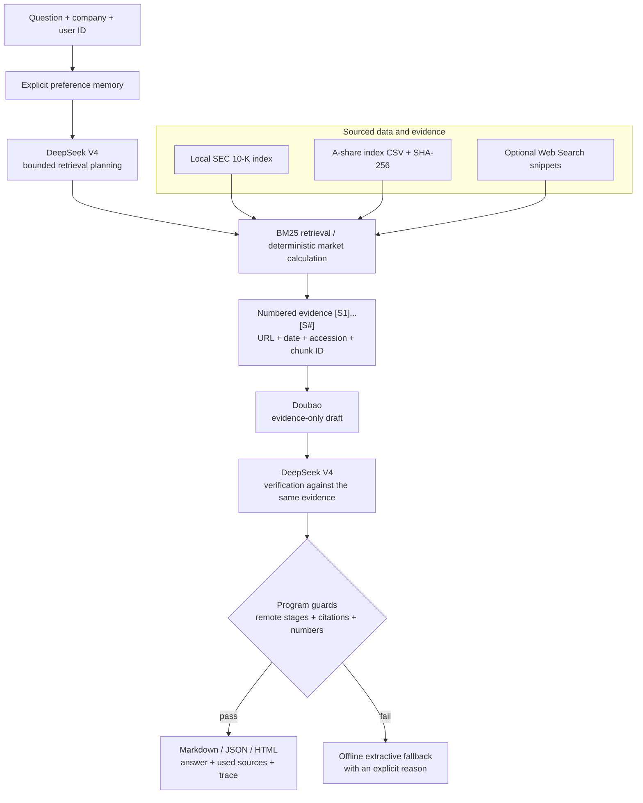

# Evidence-First Financial Agent

[](https://github.com/sky910140/financial-agent-takehome/actions/workflows/ci.yml)

[中文](README.md) | English

A locally runnable, traceable, and verifiable personal financial research agent. It retrieves sourced evidence from SEC 10-K filings, major A-share indices, and optional public Web results before `doubao-seed-evolving` drafts an answer and DeepSeek V4 plans and verifies it. If remote stages, citations, or numeric checks fail, the system explicitly falls back to an offline extractive answer.

This project does not provide investment advice, execute trades, or treat model training knowledge as a current data source.

## Verifiable Snapshot

| Area | Current result |
| --- | --- |
| SEC corpus | Latest 10-K for 10 companies, 3,978 searchable chunks |
| China market data | CSI 300, Shanghai Composite, Shenzhen Component, 20+ years of daily close and volume |
| Retrieval evaluation | 5 golden questions, Hit@5 = 5/5 |
| Automated tests | 44/44 passing, 88% coverage |
| Multi-model path | DeepSeek planning → Doubao drafting → DeepSeek verification |
| Output formats | Markdown, JSON, self-contained safe HTML |
| Failure behavior | Explicit fallback for model, network, citation, or numeric-guard failures |

## Architecture



The key design choice is not simply calling two models. It is separating responsibilities and keeping the final trust decision in deterministic code. See [DESIGN.md](DESIGN.md) for the full tradeoff discussion.

## Run in Five Minutes

Python 3.11+ is required. The runtime has no mandatory third-party dependency. The checked-in market files and SEC retrieval index make the core demo runnable without downloading external data.

```powershell
git clone https://github.com/sky910140/financial-agent-takehome.git
cd financial-agent-takehome
python -m venv .venv
.\.venv\Scripts\Activate.ps1
python -m pip install -e .
```

Start with two fully offline, deterministic checks:

```powershell
# 20-year CSI 300 period snapshot
python -m finagent market --file data/market/csi300.csv --start 2006-07-10 --end 2026-07-10

# Retrieval regression evaluation
python -m finagent eval-retrieval
```

The SEC question path also runs without model credentials:

```powershell
python -m finagent ask "Summarize liquidity and debt-related risks." --company Apple --trace
```

Without credentials, the output explicitly states `Offline extractive mode` while preserving the SEC URL, filing date, accession, and chunk ID.

## Configure the Two Required Models

```powershell
Copy-Item .env.example .env
```

Fill in the following variables. `.env` is Git-ignored and must never be committed.

```dotenv
DOUBAO_API_KEY=your_Ark_API_key
DOUBAO_BASE_URL=https://ark.cn-beijing.volces.com/api/v3/chat/completions
DOUBAO_MODEL=doubao-seed-evolving

DEEPSEEK_API_KEY=your_DeepSeek_API_key
DEEPSEEK_BASE_URL=https://api.deepseek.com/chat/completions
DEEPSEEK_MODEL=deepseek-v4-pro
```

Verify connectivity first, then require the complete remote path:

```powershell
python -m finagent verify-models
python -m finagent smoke-demo
```

`verify-models` sends only a fixed `READY` request and no financial documents. `smoke-demo` exits successfully only when planning, drafting, and verification all use the remote models and the final citation and numeric guards pass.

Expected trace:

```text
planning: deepseek / deepseek-v4-pro / remote=True / ok
analysis: doubao / doubao-seed-evolving / remote=True / ok
verification: deepseek / deepseek-v4-pro / remote=True / ok
```

## Representative Demos

```powershell
# Main risk factors
python -m finagent ask "What are this company's main risk factors?" --company Tesla --trace

# Prior-year revenue and profitability change
python -m finagent ask "How did revenue or profitability change compared with the prior year?" --company Microsoft --trace

# Competition disclosures
python -m finagent ask "What does the company say about competition?" --company Amazon --trace

# Long-term preference memory
python -m finagent ask "I care most about liquidity risk and debt maturity." --company JPM --user alice
python -m finagent ask "What should I focus on?" --company JPM --user alice --json --trace

# Optional public Web discovery; snippets remain labelled web_search
python -m finagent ask "Apple 10-K SEC filing" --company Apple --web --trace
```

Recorded commands and outputs are available in [DEMO_OUTPUTS.md](DEMO_OUTPUTS.md).

## Output Formats

Markdown is the default. Use `--json` for integrations, `--html` for a self-contained browser report, and `--trace` for non-sensitive execution status.

```powershell
python -m finagent ask `
  "Summarize liquidity and debt-related risks." `
  --company Apple `
  --html `
  --trace |
  Set-Content -Encoding utf8 apple-liquidity-report.html

Start-Process .\apple-liquidity-report.html
```

The HTML renderer escapes dynamic text, links only absolute HTTP(S) sources, and includes a restrictive Content Security Policy. `--json` and `--html` are mutually exclusive.

## Data and Provenance

| Dataset | Checked-in artifact | Preserved provenance |
| --- | --- | --- |
| SEC 10-K | `data/index/filing_chunks.json` | company, CIK, filing/report date, accession, SEC URL, document/chunk ID |
| CSI 300, Shanghai Composite, Shenzhen Component | `data/market/*.csv` and `.meta.json` | endpoint, every yearly request URL, download time, coverage, SHA-256 |
| Public Web | request-local `web_search` evidence | title, result URL, snippet; never silently promoted to parsed SEC evidence |
| User preferences | local `data/memory/preferences.json` | explicit allow-listed preferences only; never committed |

Raw SEC HTML is excluded to keep the repository small. The download and rebuild path remains reproducible:

```powershell
$env:SEC_USER_AGENT = "FinancialAgent your-email@example.com"
python scripts/download_sec_10k.py --years 1 --output-dir sample_docs/sec_10k
python -m finagent index --docs-dir sample_docs/sec_10k --output data/index/filing_chunks.json
python -m finagent download-markets --output-dir data/market --start-year 2005
```

## Tests and Evaluation

```powershell
python -m pip install -r requirements-dev.txt
$env:PYTHONPATH = "src"
python -m coverage run -m unittest discover -s tests
python -m coverage report --fail-under=80
python -m compileall -q src scripts tests
python -m finagent eval-retrieval
```

Coverage includes SEC recent/history downloads, incomplete-download exit behavior, XBRL noise filtering, BM25 and financial phrase handling, market date and checksum validation, preference memory, per-stage model budgets, empty model responses, mandatory verification, numeric drift, citation convergence, Web evidence classification, CLI errors, and safe HTML rendering.

GitHub Actions runs compilation, tests, and retrieval evaluation on Python 3.11 and 3.13 without model credentials or external network access.

## Repository Layout

```text
src/finagent/                 Agent, retrieval, models, data, memory, and output
scripts/                      SEC and market download entry points
tests/test_finagent.py        Unit and integration tests
evals/retrieval_cases.json    Golden retrieval questions
data/index/                   Checked-in SEC retrieval index
data/market/                  Three index CSV files and provenance metadata
DESIGN.md                     1-2 page architecture and tradeoff document
DEMO_OUTPUTS.md               Reproducible commands and recorded outputs
docs/PROJECT_STRUCTURE_CN.md  File-level implementation reference in Chinese
```

## Known Boundaries

- BM25 is interpretable lexical retrieval, not open-domain semantic search. The current 5/5 result applies only to five golden questions.
- Flattened HTML cannot preserve every complex financial-table relationship. Numeric claims should be checked against the original filing; an XBRL fact layer is the next priority.
- Public Web results are variable and snippets are not first-party financial evidence.
- The numeric guard rejects values absent from the supplied evidence but does not prove semantic entailment for every non-numeric claim.
- Local preference memory has no authentication, encryption, concurrency control, or deletion API and is not production storage.
- The current interface is CLI plus static HTML rather than a multi-turn chat UI, prioritizing reproducibility, citations, and explicit failure behavior.

Further reading:

- [System design](DESIGN.md)
- [Reproducible demo outputs](DEMO_OUTPUTS.md)
- [Project structure and implementation map](docs/PROJECT_STRUCTURE_CN.md)
- [Market data notes](data/market/README_EN.md)
